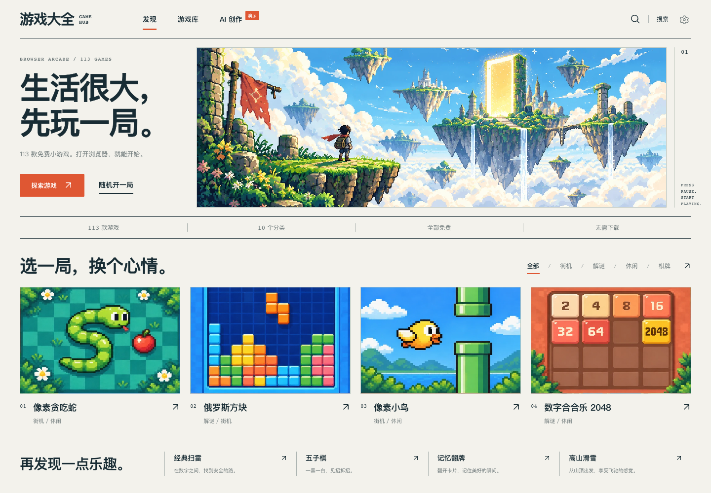

# 游戏大全 GAME HUB

一个点开即玩的浏览器小游戏平台：截至 **2026-10-10**，线上收录 **113 款小游戏，覆盖 10 个分类**，支持关键词搜索、分类筛选、排序、随机开局、游戏详情和嵌入式试玩。基于 Vue 3 + Vite，门户采用明亮彩色像素插画与杂志式排版。

每款游戏使用自包含 HTML，新增游戏可自动校验并登记；构建前执行注册表校验、静态检查与模拟环境初始化冒烟。平台还提供 AI 创作演示页与模型配置界面，实际生成后端尚未接入。

- **线上地址**：https://awiggy.github.io/game-hub/
- **仓库**：https://github.com/awiggy/game-hub
- **部署**：push 到 main 即自动构建发布（GitHub Actions → GitHub Pages）

## 项目预览

[](https://awiggy.github.io/game-hub/)

2026-10-10 截取的线上游戏大厅。点击图片进入网站；这是真实运行界面，不是概念海报。

## 能做什么

- **找游戏**：按 10 个分类筛选，搜索名称、简介或玩法标签，按最新加入或名称排序。
- **立即开玩**：进入详情查看操作说明，再在页面内游玩；也可以随机开一局。
- **多种玩法**：包含斗地主、国际象棋、丛林突击、黄金矿工、吃豆小人、2048、贪吃蛇等；具体规则和操作以各游戏说明为准。
- **持续扩展**：每款游戏有独立入口与元数据，构建管线自动登记并检查，参考来源与改编说明见 [SOURCES.md](SOURCES.md)。
- **说明边界**：AI 创作与模型设置界面仍属演示，尚未接入真实生成后端。单款游戏的交互验证不等同于全部关卡、长期游玩和平衡性均已验收。

## 开发

2026-09-26 的门户视觉重构采用明亮彩色像素插画与杂志式排版，见 [设计与验收记录](docs/design/2026-09-26/implementation.md)。游戏内部仍保留原有界面；站点通过 main 分支的 GitHub Pages 工作流发布。

```bash
npm install
npm run dev      # http://localhost:5173（启动前自动重建注册表）
npm run check    # 检查每款游戏的文件、脚本语法、元数据与状态钩子
npm run smoke    # 模拟 DOM / Canvas 检查游戏同步初始化错误
npm run build    # registry → check → smoke → 构建 dist/；失败会阻止发布
```

## 当前状态（2026-10-10 核对）

- **线上首页、游戏库与注册表均为 113 款，覆盖 10 个分类**；数量来自 [自动生成的游戏注册表](src/data/games.json)，不计入 `drafts/` 历史草稿或独立海报页面。
- 最近新增：欢乐斗地主、国际象棋、丛林突击；星环躲避已正式加入货架，旧草稿不重复计数。
- 正式构建按 `registry → check → smoke → build` 执行。冒烟使用模拟 DOM / Canvas 检查初始化错误，不能代替真实浏览器的玩法与触屏验收。
- 当前在线版本可游玩；AI 生成后端、用户登录、发布与评论仍未实现。
- 历史开发与验收记录见 [PROJECT_MEMORY.md](PROJECT_MEMORY.md)；此前记录中的数量是当时快照，不代表当前库存。

## 游戏目录

[打开完整游戏库 →](https://awiggy.github.io/game-hub/#/library)

街机、解谜、休闲、棋牌、动作、射击、策略、模拟、体育、竞速，共 10 个分类。一款游戏可以属于多个分类，因此分类数量不能直接相加作为游戏总数。

完整名称、分类与操作说明以[注册表](src/data/games.json)和各游戏详情页为准，不再在这里维护一份容易过期的手写货架。

## 结构

```
├── index.html / vite.config.js / package.json   # 门户应用（Vite + Vue3）
├── scripts/build-registry.js                    # ★ 注册脚本：扫描 games/ 生成注册表
├── scripts/check-games.js                       # 静态检查（正式构建前自动执行）
├── src/
│   ├── pages/          # 首页 / 游戏库 / 游戏详情
│   ├── components/     # 导航、游戏卡片、试玩框架
│   ├── data/games.json # 注册表（脚本生成，勿手改）
│   └── game-meta.js    # 分类元数据（名称/图标/配色）
├── drafts/             # 未完成游戏资料，不注册、不发布
└── games/              # ★ 每个游戏 = 一个自包含目录（Vite publicDir）
    ├── snake/
    │   ├── meta.json   #   游戏元数据（注册来源）
    │   └── index.html  #   自包含游戏页，详情页 iframe 嵌入试玩
    └── .../            #   tetris / breakout / flappy / planewar / minesweeper ...
```

## 如何新增一个游戏

1. 在 `games/` 下新建与游戏 id 同名的文件夹
2. 放入自包含的 `index.html`（纯静态、无构建、无外部依赖）和 `meta.json`
3. 运行 `npm run check`，检查文件、JavaScript 语法和元数据
4. 运行 `npm run registry`（dev / build 前会自动执行），生成门户使用的清单
5. 在浏览器验证开始、操作、结束、重开及触屏操作，再运行 `npm run build`

静态检查不能保证游戏逻辑正确；浏览器验收仍是发布前的必要步骤。缺少入口或存在脚本语法错误时，构建会中止，GitHub Actions 不会发布这次产物。

`meta.json` 必填字段：`id`（=目录名）、`name`、`emoji`、`categories`（见 `src/game-meta.js` 的 10 个分类）、`summary`、`description`、`howToPlay`、`entry`。

## 游戏开发约定

- 单文件 HTML，零外部依赖，深色主题（`#0f1118` 背景 + 蓝黄强调色）
- 暴露 `window.__hub = { score, over, started }` 状态钩子——供中台自动验收与后续「AI 生成游戏」的沙箱检测使用
- 支持键盘与触屏，最高分 / 纪录用 localStorage 持久化（key 加游戏前缀）

## 路线图

- [x] 门户骨架（首页 / 游戏库 / 详情页 / iframe 试玩）
- [x] 注册脚本：扫描 `games/` 自动生成注册表
- [x] 第一批 10 款游戏覆盖 8 个分类
- [x] 静态检查接入正式构建与现有自动部署流程
- [x] 扩充至 113 款并同步注册表（2026-10-10 核对）
- [ ] 逐款完成深度玩法、难度与长时间游玩验收
- [x] 「AI 创作」创作页 UI（选分类 → 一句话描述 → 生成 → 沙箱预览；后端未接入前自动进入演示模式）
- [x] AI 服务配置页（`/#/settings`，⚙️ 入口）：供应商 / Base URL / key / 模型随时可换
- [ ] 生成后端：`/api/generate` 云函数（模板 prompt 组装 → LLM 生成 → 校验 → 沙箱检测）
- [ ] 用户系统（登录 / 发布 / 评论）

## AI 生成服务接口契约（后端按此实现）

| 端点 | 方法 | 说明 |
|---|---|---|
| `/api/ai/settings` | POST | 保存 LLM 配置（provider/baseUrl/model/apiKey/dailyLimit）；**key 只存服务端，端点必须加管理鉴权** |
| `/api/ai/settings` | GET | 读取配置，key 以掩码返回（`****abcd`） |
| `/api/ai/test` | POST | 用当前配置发最小 chat 请求，返回 `{ok, message}` |
| `/api/generate` | POST | `{category, prompt}` → `{id, entry, name, emoji, summary}`；创作页已按此对接 |

后端未上线时：创作页自动进入演示模式；配置页把 key 本地暂存在浏览器 `localStorage`（`hub-ai-settings`），并在页面明确标注。
