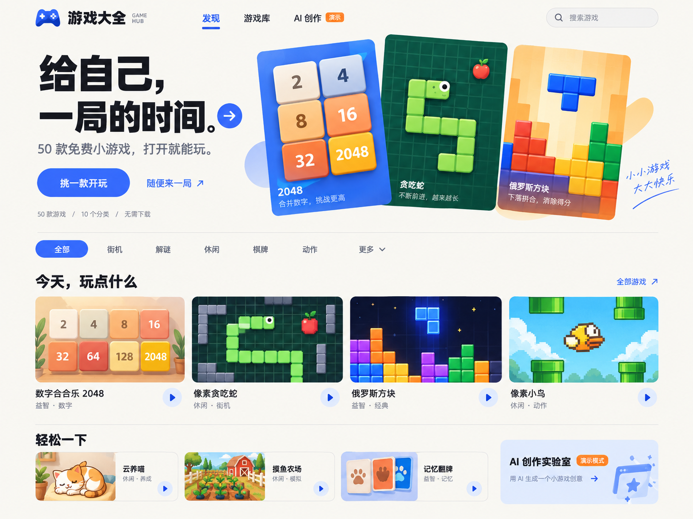
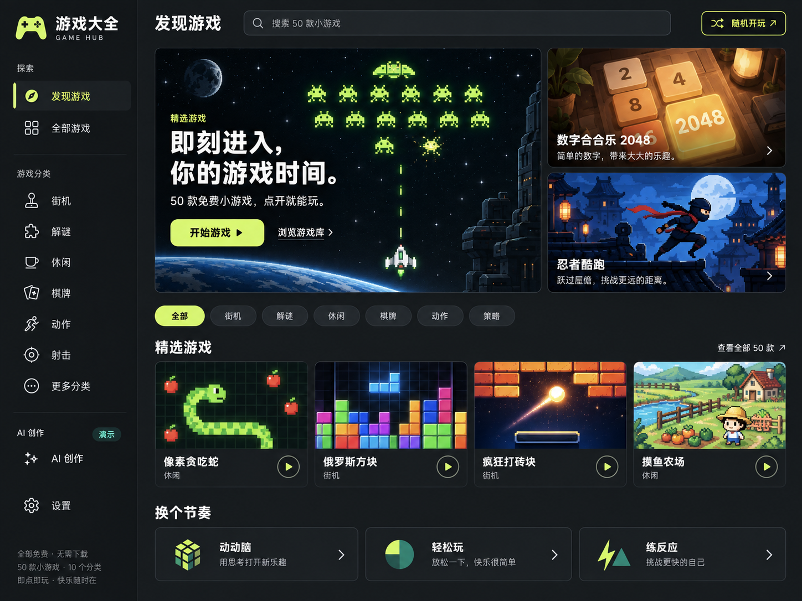
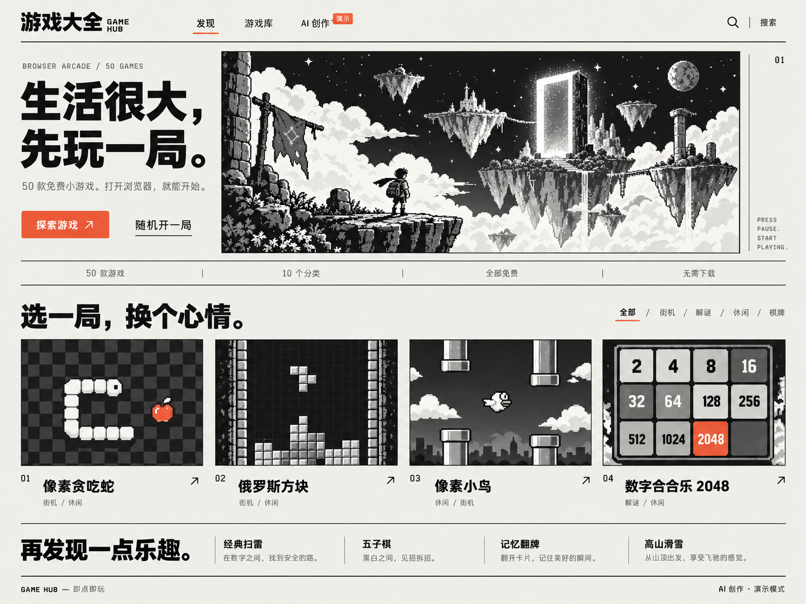

# 首页视觉探索 · 2026-09-26

初始提供三版首页样图。用户最终以截图确认为 C「像素独立杂志」的结构，要求改为明亮彩色。现已完成网站重构，见 [实现与验收](./implementation.md)；本轮未修改游戏内部，网站通过 GitHub Pages 工作流发布。

## 已读取的项目背景

- `PROJECT_MEMORY.md`、`README.md`，以及首页、导航、游戏卡片、游戏库和全局样式。
- 50 款已登记小游戏，10 个分类，Vue 3 + Vite。
- AI 创作仍为演示流程，视觉方案须保留「演示」标识。
- 已有黑白像素动态海报可作为独立视觉方向的来源。

## 这次要解决的问题

当前首屏的大段介绍和独立数据卡片占据主要空间，游戏内容露出太晚。粗边框、硬阴影、网格背景和 emoji 同时出现，视觉层级容易被装饰淹没。重构应先缩短从进入首页到选中游戏的路径，再统一封面、文字、留白和交互。

## 方案

| 方案 | 视觉方向 | 适合的定位 |
| --- | --- | --- |
| A · 明亮游乐场 | 奶油白、钴蓝、少量橙色；柔和的游戏封面；清晰的浏览层级 | 未采用 |
| B · 深夜街机厅 | 炭黑、荧光绿；侧栏导航；精选游戏主视觉 | 更有游戏启动器和街机厅的沉浸感 |
| C · 像素独立杂志 | 像素插画、细分隔线、编辑式排版、朱红色操作点缀 | 已采用结构，实际落地改为明亮彩色 |

### A · 明亮游乐场

### B · 深夜街机厅

### C · 像素独立杂志

## 后续落地范围

已统一首页、游戏库、游戏详情、导航与移动端，搜索与随机开玩已接入实际游戏列表。封面为概念插画，不代表游戏内部画面。AI 创作持续标示演示状态。

概念样图与新增网站插画均由内置 image_gen 生成。概念样图提示词见 [prompts.md](./prompts.md)，实际使用的彩色像素插画提示词见 [pixel-assets-prompts.md](./pixel-assets-prompts.md)。用户已要求将本轮改动提交至 GitHub 并更新 Pages 站点。
